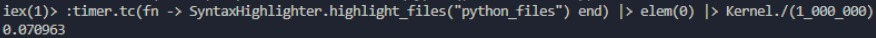
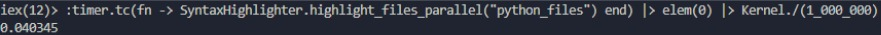
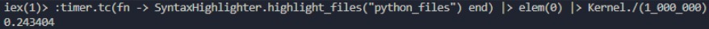
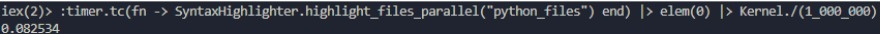

## Author

 **Name**: Santiago Benitez


# Python Syntax Highlighter

This program implements a syntax highlighter for Python files using regular expressions. Its main function is to take a Python file as input, highlight the different lexical categories the programming language: comments, keywords, identifiers, operators, delimiters, numbers, strings, built-in functions and generate an HTML file that displays the highlighted code.

There are two versions of the program: highlight_files/1 and highlight_files_parallel/1.

The sequential version (highlight_files/1) processes the files one by one. It uses Path.wildcard/1 to get a list of Python files in a given directory, then maps over the list and calls highlight_file/1 for each file.

The parallel version (highlight_files_parallel/1) processes the files concurrently using parallel tasks. It follows the same steps as the sequential version, but it uses Task.async/1 to create a task for each file and Task.await/1 to wait for the completion of each task.

## Algorithm

The algorithm used by the program is as follows:

1. Iterate over each line of the Python file recursively.
2. For each line, call the `highlight_line` function to process it with the tokens found.
3. The `highlight_line` function, in turn, calls the `highlight_token` function to process each token that is matched at the beginning of the line and generate a `<span></span>` html element with a class of the type of token found and the actual token.
4. The final result is stored and appended as each line is processed.

## Algorithm Complexity

The complexity of the algorithm depends on the number of tokens and lines in the Python file. In the worst case scenario, if there are `n` lines and `m` tokens in each line, the complexity would be `O(n * m)`. However, the complexity also depends on the performance of regular expression matching and string manipulation operations in the underlying programming language implementation.

If highlighting one file has a time complexity of O(m * n), where m represents the number of lines in the file and n represents the average number of tokens per line, then the time complexity of highlighting multiple files depends on the approach used.

### Sequential Version

If we have k files, and each file has an average of m lines and n tokens per line, the time complexity of highlighting all the files in the sequential version would be O(k * m * n).
Parallel Version:

### Parallel Version

In the parallel version, the files are processed concurrently, potentially reducing the overall execution time.
If we assume the number of available CPU cores is c, and we have k files with an average of m lines and n tokens per line, the time complexity would be reduced to approximately O((k * m * n) / c).
The actual performance improvement achieved by parallel execution can vary based on factors such as the number of CPU cores, the complexity of regular expressions, and the distribution of workload among files.


## Time and Speedup Analysis

The execution time and speedup analysis reveals the performance gains achieved by leveraging parallel processing for the given test files: `in_file1.py`, `in_file2.py`, `in_file3.py`, and `in_file4.py`.

### Sequential Version

In the sequential version, the execution time for processing 4 files is measured at 0.07 seconds.




### Parallel Version

In the parallel version, 4 cores are utilized for the parallel processing. The execution time for processing the same 4 files reduces to 0.04 seconds.




The achieved speedup is calculated as follows:

```
Speedup (S4) = T1 / T4 = 0.07s / 0.04s = 1.76
```

This indicates that the parallel version is approximately 1.76 times faster than the sequential version for processing 4 files.

### Increased Workload: 8 Files

When the workload is increased to 8 files, the execution time for the sequential version rises to 0.24 seconds.



In contrast, the parallel version with 4 cores achieves an execution time of 0.08 seconds.




The speedup for processing 8 files is calculated as follows:

```
Speedup (S8) = T1 / T8 = 0.24s / 0.08s = 3
```

This reveals that the parallel version is approximately 3 times faster than the sequential version for processing 8 files.

### Analysis and Considerations

The time and speedup analysis highlights the benefits of parallel processing in reducing execution times and improving performance, especially for larger workloads.

It is important to note that the reduction in time may not always be directly proportional to the number of processors or cores used. Factors such as program characteristics, task dependencies, communication overhead, and the efficiency of parallelization approaches can impact the achieved speedup.

Additionally, it is essential to consider the physical limitations of the hardware. Utilizing more cores than available can lead to resource saturation, overwhelming the system and potentially resulting in decreased performance.

By carefully analyzing the program, optimizing parallelization techniques, and considering hardware limitations, it is possible to harness the benefits of parallel processing and achieve improved efficiency and performance.

## Efficiency and Performance

Regular expressions are a powerful tool for pattern matching in text. However, if the Python file is very large or contains a large number of tokens, the intensive use of regular expressions may impact the program's performance. In such cases, alternative approaches, such as more advanced lexical and grammatical analysis, could be considered for improved efficiency.

Parallel technologies provide enhanced performance and efficiency by leveraging multiple processors or threads to perform tasks simultaneously. They enable faster processing times, scalability to handle large workloads and data sets, and maximize resource utilization. Parallel computing is essential for high-performance computing, real-time applications, and data-intensive tasks. However, challenges such as overhead, algorithm design, scalability, and power consumption must be carefully addressed to ensure optimal performance and responsible use of parallel technologies.

## Ethical Implications

The greatest ethical implication I could find was that Regular expressions can be effective in many cases, but they may not accurately address all possible variations of tokens in the code. For instance, I am well aware that even though I tried to cover as many lexical categories as possible, it could be that the language adds new ones or that I missed some. If the syntax highlighter relies solely on regex, there is a risk of false positives or negatives, which could lead to an inaccurate representation of the code. This can be problematic if developers blindly rely on the syntax highlighter and make decisions based on a misinterpretation of their code.

In terms of the parallel version of the program, parallel technologies are used to perform analysis and make automated decisions that can have a significant impact on society, such as in the field of artificial intelligence. It is essential to ensure transparency, accountability, and fairness in the algorithms and models used, avoiding biases and unfair discrimination.

## Usage

To run an Elixir script file (`.exs`) from the terminal, follow these steps:

1. Make sure you have Elixir installed on your system. You can check the installation by running the following command:

   ```shell
   elixir --version
   ```

   If Elixir is not installed, you can download and install it from the [official Elixir website](https://elixir-lang.org/).

2. Clone this repository in a directory.

2. Open your terminal or command prompt.

3. Navigate to the directory where you cloned this repository. 

4. Once you are in the correct directory, run the Elixir script file using the `elixir syntax-highlighter.exs` or `iex syntax-highlighter.exs` command. 

5. Run the program by executing the following:

      ### highlighting 1 file:

      ```
      SyntaxHighlighter.highlight_file({"./in_file1.py", "./out_file.html"})
      ```


      ### highlighting files in one directory (sequential)

      ```
      SyntaxHighlighter.highlight_files("python_files")
      ```


      ### highlighting files in one directory (parallel)


      ```
      SyntaxHighlighter.highlight_files_parallel("python_files")
      ```
6. You can try the program with the different .py files that are in the repository.
